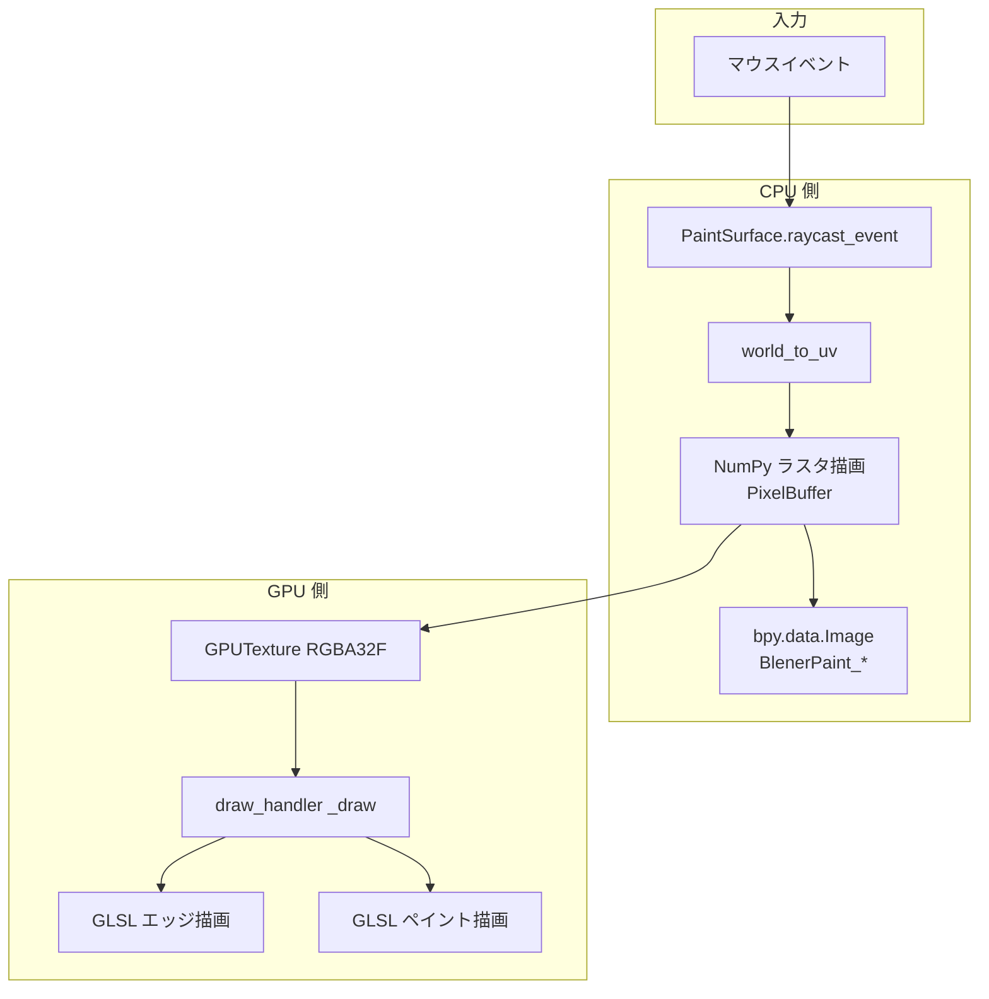
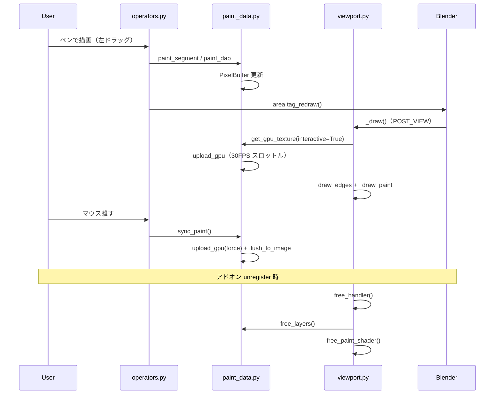

# ビューポート描画の処理フロー

Paint Canvas アドオンにおける **3D ビューへの描画**（エッジ表示・ペイント表示）の全体像を説明する。

---

## 概要

ビューポート上の描画は **Blender の Mesh マテリアルではなく**、`gpu` モジュール + カスタム GLSL + `SpaceView3D.draw_handler` によって行う。

```
マウス入力
  → CPU ラスタ（NumPy）
  → bpy.data.Image（.blend 永続化）
  → gpu.types.GPUTexture（ビューポート表示用）
  → カスタム GLSL シェーダー
  → draw_handler（POST_VIEW）
```

F12 レンダーは別経路（`material.py` で一時的にマテリアルを差し替え）。本ドキュメントでは **ビューポート描画** に焦点を当てる。

---

## 関連ファイル

| ファイル | 役割 |
|----------|------|
| `viewport.py` | draw_handler の登録・毎フレーム描画 |
| `shader.py` | ペイント用・エッジ用 GLSL シェーダー |
| `paint_data.py` | CPU バッファ、Image 同期、GPUTexture アップロード |
| `paint_surface.py` | プレーン座標系、レイキャスト、UV 変換 |
| `operators.py` | ペン入力 → ラスタ描画 → `tag_redraw` |
| `material.py` | ビューポートでは **Mesh を非表示** にする設定（Z-fighting 回避） |

---

## 全体フロー図



---

## 1. 初期化（draw_handler 登録）

### タイミング

- アドオン `register()` → `viewport.ensure_handler()`
- 「キャンバスを作成」「ペンで描画」開始時にも `ensure_handler()` を呼ぶ

### 処理（`viewport.py`）

```python
bpy.types.SpaceView3D.draw_handler_add(_draw, (), "WINDOW", "POST_VIEW")
```

| 項目 | 値 |
|------|-----|
| コールバック | `_draw` |
| スペース | `WINDOW`（3D ビュー全体） |
| 描画タイミング | `POST_VIEW`（シーン描画の直後） |

`POST_VIEW` を選ぶ理由: Blender が Mesh 等を描画した **後** にオーバーレイを重ねるため。

---

## 2. 入力〜CPU ラスタ（ペン描画）

### 2.1 マウス → プレーン上の UV

`operators.py`（モーダルオペレーター）が `PaintSurface` を使う。

```
マウス座標（region）
  → region_2d_to_origin_3d / region_2d_to_vector_3d
  → intersect_line_plane（プレーンとの交点）
  → world_to_uv（ローカル XY → UV 0..1）
```

**UV 変換**（`paint_surface.py`）:

- プレーン local 座標 `(-1..1, -1..1)` を UV `(0..1, 0..1)` にマップ
- `_PLANE_UV_SCALE = 0.5` により `uv = local * 0.5 + 0.5`
- デフォルト Blender プレーン（size=2）の UV と一致

### 2.2 UV → ピクセル座標

`paint_data.py` の `uv_to_pixel`:

```python
x = round(uv.x * (width - 1))
y = round((1.0 - uv.y) * (height - 1))  # Y 軸反転（Image 座標系）
```

### 2.3 ラスタ描画

`PixelBuffer`（NumPy `uint8` 配列 H×W×4）に描く。

| 関数 | 用途 |
|------|------|
| `_stamp_disc` | 単点（円形 dab） |
| `_paint_segment` | 2 点間の太線分（距離場ベクトル化） |
| `_blend_src_over` | アルファ合成（src-over） |

描画後 `buffer.mark_dirty_rect()` で更新領域を記録し、`layer.invalidate_gpu()` で GPU キャッシュを無効化。

### 2.4 再描画トリガー

ペン操作中は `context.area.tag_redraw()` を呼ぶ。  
`tag_redraw` だけでは GPU テクスチャは更新されない。**次の `_draw` 呼び出し時** に `get_gpu_texture()` がアップロードを実行する。

---

## 3. CPU → GPU テクスチャ

### 3.1 データの二重管理

`PaintPixelLayer` が以下を保持する。

| 保持先 | 用途 |
|--------|------|
| `buffer`（NumPy） | 編集・ラスタ描画 |
| `image`（bpy.types.Image） | .blend 保存、レンダー用マテリアル |
| `_gpu_texture`（GPUTexture） | ビューポート draw_handler |

### 3.2 Image への書き込み（永続化）

`flush_to_image()` — ストローク終了時（`sync_paint`）など:

```
buffer.pixels (uint8, 上→下)
  → flipud
  → float32 / 255.0
  → image.pixels.foreach_set
```

### 3.3 GPUTexture へのアップロード

`upload_gpu()` — 毎 `_draw` で `get_gpu_texture()` 経由:

```
buffer.pixels (uint8)
  → flipud → float32 / 255.0  (_flip_cache)
  → gpu.types.Buffer("FLOAT", ...)
  → gpu.types.GPUTexture(format="RGBA32F")
```

> Blender 4.2 では `GPUTexture` に **FLOAT バッファのみ** 対応（`UBYTE` / `RGBA8` は不可）。

### 3.4 スロットル（ドラッグ中の負荷軽減）

| 条件 | 動作 |
|------|------|
| `interactive=True`（`is_painting` 中） | 最大 **30 FPS**（`_GPU_FPS = 30.0`）でアップロード |
| `interactive=False` | dirty または force 時に即アップロード |
| dirty でない & テクスチャ既存 | スキップ |

---

## 4. 毎フレーム描画（`_draw`）

Blender が 3D ビューを描画するたびに `_draw()` が呼ばれる。

### 4.1 早期リターン条件

1. `scene.bleneraddontest` が存在しない
2. `PaintSurface.is_valid()` — 対象プレーン未設定
3. `region_data` が None
4. `get_pixel_layer()` が None
5. `get_gpu_texture()` が None

### 4.2 描画順序

```
1. _draw_edges()   … キャンバス枠線（GLSL LINE_STRIP）
2. _draw_paint()   … ペイントテクスチャ（GLSL TRI_FAN）
```

### 4.3 ジオメトリ

プレーン **ローカル座標** の四角形（`matrix_world` でワールド変換）:

| 用途 | 頂点（local） | UV |
|------|---------------|-----|
| ペイント | (-1,-1,0) (1,-1,0) (1,1,0) (-1,1,0) | (0,0)(1,0)(1,1)(0,1) |
| エッジ | 上記 4 点 + 閉じる | なし |

`batch_for_shader` でバッチを生成。バッチはモジュール全局変数 `_paint_batch` / `_edge_batch` にキャッシュ（プレーン形状は固定のため）。

### 4.4 シェーダー（`shader.py`）

**ペイントシェーダー**

- 頂点: `gl_Position = viewProjectionMatrix * modelMatrix * pos`（法線方向 +0.001 オフセット）
- フラグメント: `texture(image, uv)`

**エッジシェーダー**

- 頂点: 同上（法線方向 +0.002 オフセット）
- フラグメント: 固定色 `edgeColor`（灰 0.35）

### 4.5 GPU ステート

両描画とも共通:

```python
gpu.state.blend_set("ALPHA")
gpu.state.depth_test_set("LESS_EQUAL")
gpu.state.depth_mask_set(False)   # 深度バッファには書き込まない
```

描画後にステートをリセット。

---

## 5. Z-fighting 回避

プレーン Mesh と GPU オーバーレイが同位置だと深度競合（Z-fighting）が起きる。

### 対策（現在の実装）

| 手段 | 内容 |
|------|------|
| Mesh 非表示 | キャンバス作成時 `plane.hide_viewport = True` — Blender 標準描画で **面を描かない** |
| GLSL エッジ | 枠線は draw_handler が描画（Mesh に依存しない） |
| 法線オフセット | シェーダーで +Z 方向に微小移動（0.001 / 0.002） |

通常編集時、ビューポートに見えるのは **GLSL エッジ + GLSL ペイントのみ**。

---

## 6. ライフサイクル



---

## 7. 主要 API 一覧

### viewport.py

| 関数 | 説明 |
|------|------|
| `ensure_handler()` | draw_handler を 1 回だけ登録 |
| `free_handler()` | handler 解除、バッチ・GPU リソース解放 |
| `tag_redraw(context)` | 全 3D ビューの `area.tag_redraw()` |

### paint_data.py

| 関数 | 説明 |
|------|------|
| `get_pixel_layer(context)` | レイヤー取得（キャッシュ `_LAYER_CACHE`） |
| `paint_segment` / `paint_dab` | ラスタ描画入口 |
| `sync_paint(context)` | GPU 強制アップロード + Image 書き込み |
| `clear_paint(context)` | バッファクリア + Image 更新 |

### paint_surface.py

| 関数 | 説明 |
|------|------|
| `raycast_event(event)` | マウスレイ → プレーン交点 |
| `world_to_uv(world_co)` | ワールド → UV |
| `plane_coords()` | 描画用 local 頂点 + UV |
| `matrix_world` | 対象オブジェクトのワールド行列 |

---

## 8. ビューポート描画とレンダーの関係

| | ビューポート（通常） | F12 レンダー |
|--|---------------------|--------------|
| 表示経路 | draw_handler + GLSL | Mesh マテリアル（一時差替） |
| Mesh 表示 | `hide_viewport=True` | `hide_render=False`（レンダー対象） |
| データソース | 同じ `bpy.data.Image` | 同じ Image |

レンダー時のマテリアル差し替えは `material.py` が担当。  
`render_pre` でペイントマテリアル適用 → `render_post` / `render_complete` でエッジマテリアル + `hide_viewport=True` に復帰。

---

## 9. デバッグのヒント

| 症状 | 確認ポイント |
|------|-------------|
| 何も描画されない | 対象プレーン設定、`ensure_handler()` 呼び出し |
| 描いたが更新されない | `tag_redraw` が呼ばれているか、`_draw` が実行されているか |
| ドラッグ中だけ遅延 | 30 FPS スロットル（`interactive=True`）の仕様 |
| 縞模様（Z-fighting） | `hide_viewport` が True か、古いキャンバスを使っていないか |
| テクスチャが斜め | `flipud` と UV の Y 反転（`uv_to_pixel`）の整合性 |

システムコンソールの `[Paint Canvas]` ログ（`__init__.py`）で register 失敗も確認できる。
